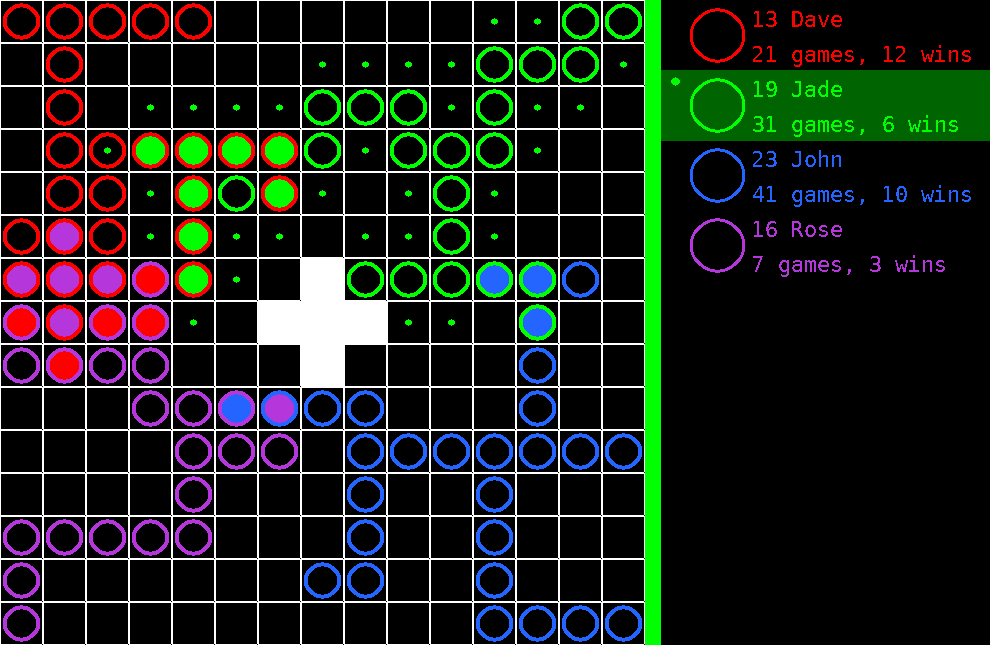

# VirusWar

## Installing dependencies
Ubuntu:

`sudo apt install libsdl2-dev libsdl2-gfx-dev libsdl2-ttf-dev`

## Usage
* Server: `VirusWar-server-exe config.json`
* Client: `VirusWar-client-exe host port`

## Rules
* The field is a rectangular grid. Two cells are neighbours if they share a side.
* Each player starts with one or more alive viruses.
* Each turn consists of several actions (usually 3)
* In one action a player may either place a new alive virus to an available empty cell
or kill a virus of another player in an available cell.
* The cell is available for a player if either of the criteria holds:
  * It is adjacent to this player's alive virus.
  * It is connected to this player's alive virus with a chain of adjacent viruses killed by them.
* A virus cannot be killed twice.
* The game is over when no player is able to make a turn.
* The score of a player is the number of their alive cells.
